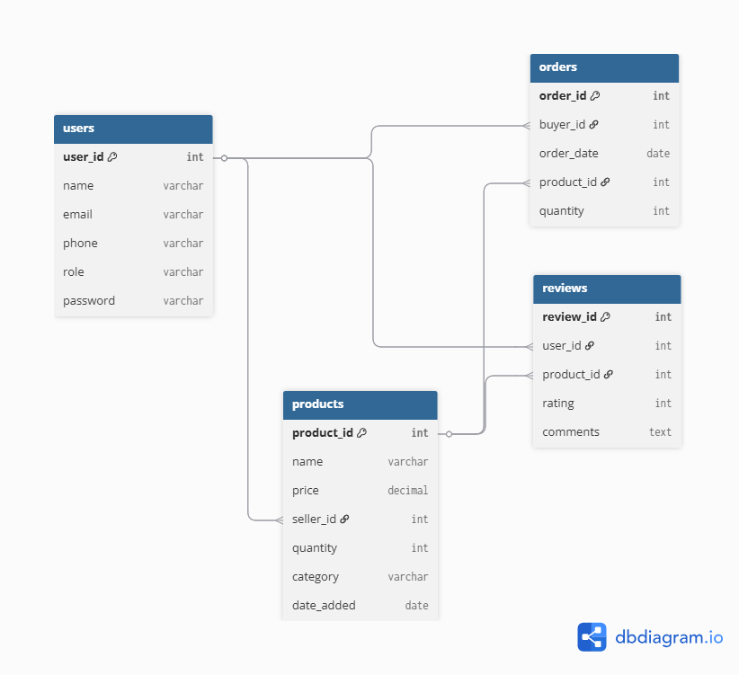

# Farm Connect - SQL Database Project

## Overview
Farm Connect is a database system designed to connect domestic farmers and buyers, allowing them to buy, sell, and review agricultural products such as animals, crops, and farming equipment. This project demonstrates skills in **SQL, relational database design, and query writing**.

## Features
- Users can be **Farmers** or **Buyers**.
- Farmers can **list products** for sale.
- Buyers can **place orders** for products.
- Users can **review products** they purchased.
- Maintains **data integrity** with primary and foreign keys.

## Database Schema
The project contains the following tables:
- **Users**: Stores user information.
- **Products**: Stores product details listed by farmers.
- **Orders**: Tracks purchases by buyers.
- **Reviews**: Stores user feedback on products.

**Relationships:**
- A User can sell multiple Products.
- A Buyer can place multiple Orders.
- Products can have multiple Reviews from Users.

## ER Diagram

